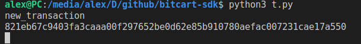

# Welcome to Bitcart SDK

Bitcart is a platform to simplify cryptocurrencies adaptation.
This SDK is part of Bitcart.
Using this SDK you can easily connect to Bitcart daemon
and code scripts around it easily.

Behold, the power of Bitcart:

```python
from bitcart import BTC

btc = BTC(xpub="your (x/y/z)pub or (x/y/z)prv or electrum seed")


@btc.on("new_transaction")
def callback_func(event, tx):
    print(event)
    print(tx)


btc.poll_updates()
```

This simple script will listen for any new transaction on your
wallet's addresses and print information about them like so:



And if you add `print(btc.get_tx(tx))` it would print
full information about every transaction, too!

To run this script, refer to [Installation](installation.md) section.
For examples of usage, check examples directory in github repository.

Supported coins list (:zap: means lightning is supported):

- Bitcoin (:zap:)
- Bitcoin Cash
- Monero
- Ethereum
- Binance coin (BNB)
- Polygon (MATIC)
- Tron (TRX)
- Ergon
- Litecoin (:zap:)
- Groestlcoin (:zap:)

To use proxy, install optional dependencies:

`pip install bitcart[proxy]`

HTTP, SOCKS4 and SOCKS5 proxies supported.

To use, pass proxy url to coin constructor:

```python
btc = BTC(proxy="socks5://localhost:9050")
```
