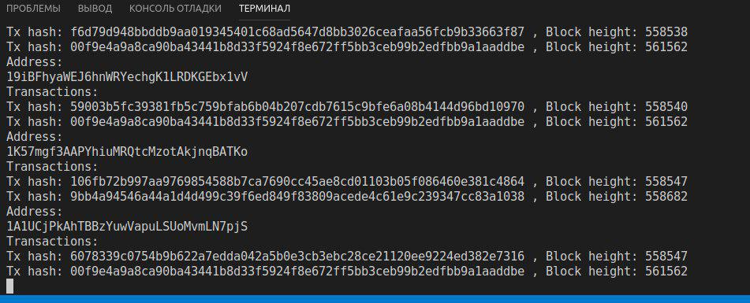

.. Bitcart SDK documentation master file, created by
   sphinx-quickstart on Tue Jul  9 22:11:54 2019.
   You can adapt this file completely to your liking, but it should at least
   contain the root `toctree` directive.

Welcome to Bitcart SDK's documentation!
=======================================

.. toctree::
   :maxdepth: 2
   :caption: Contents:

   installation
   api

Bitcart is a platform to simplify cryptocurrencies adaptation.
This SDK is part of bitcart.
Using this SDK you can easily connect to bitcart daemon
and code scripts around it easily.

Behold, the power of Bitcart:

.. code-block:: python

    from bitcart.coins.btc import BTC

    btc = BTC("http://localhost:5000", xpub="your x/y/zpub or x/y/zprv",
            rpc_user="your user for daemon", rpc_pass="password for daemon")

    @btc.notify(skip=False)
    def callback_func(txes):
        for i in txes:
            print("Address:")
            print(i["address"])
            print("Transactions:")
            for j in i["txes"]:
                print("Tx hash:", j["tx_hash"],
                    ", Block height:", j["height"])

    btc.poll_updates()

This simple script will listen for any transaction on your wallet's addresses
and print information about them like so:

And if you add ``print(btc.get_tx(j["tx_hash"]))`` it would print
full information about every transaction, too!

To run this script, refer to :doc:`installation <installation>` section.
For examples of usage, check examples directory in github repository.
